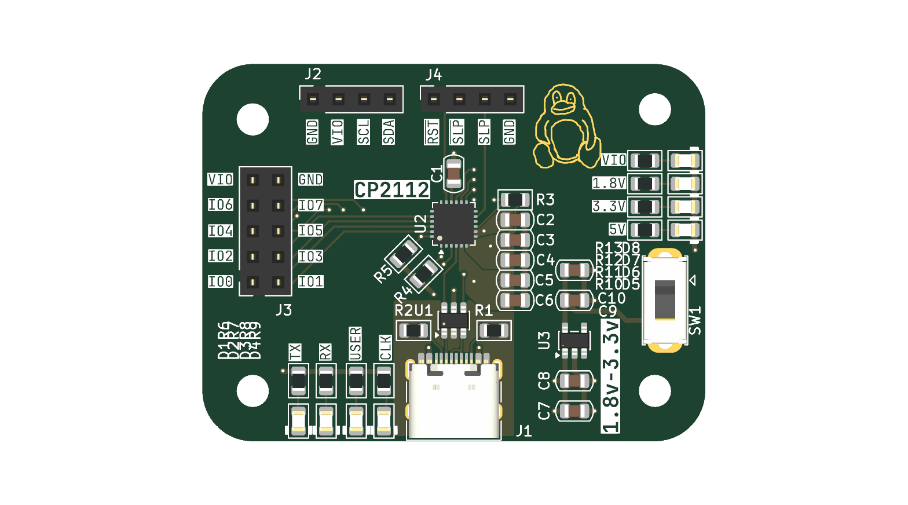
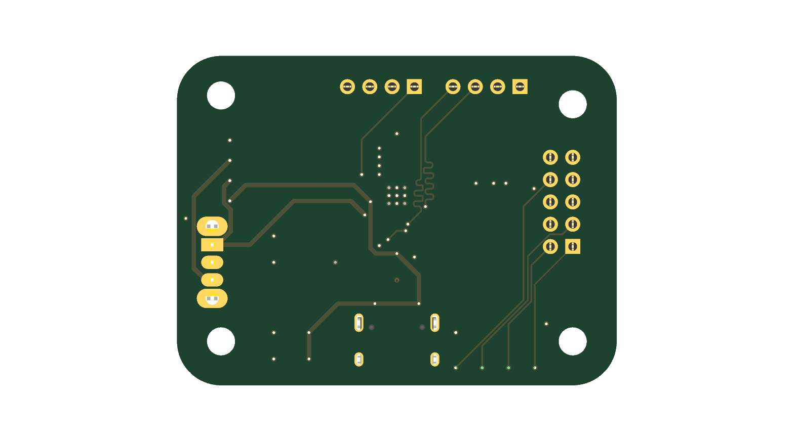
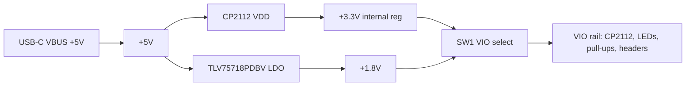

# CP2112 USB-to-SMBus Bridge Board

A small board based on the CP2112
USB to SMBus/I2C

 

## Custom Features

- CP2112 HID USB-to-SMBus/I2C - no driver install necessary
- USB-C with ESD protection
- On-board 1.8V LDO
- 8x status LEDs
- Breakout headers for I2C/SMBus and GPIO
- Slide switch for VIO selection (3.3v/1.8v)
- 4-layer PCB, 50 x 37.5 mm, 4x M3 mounting holes

## How It Works

USB -> CP2112 -> I2C

| Block | Part | Role |
|-------|------|------|
| Bridge | CP2112 | HID USB-to-UART/I2C bridge, crystal-less |
| USB | USB_C_Receptacle_USB2.0_16P (HRO TYPE-C-31-M-12) | Host connection |
| Protection | USBLC6-2SC6 | ESD clamp on D+/D- |
| Power | TLV75718PDBV | 1.8V LDO, powers VIO rail |
| I/O | 2x5 + 1x4 pin headers | UART / SMBus / GPIO access |

### Power Tree



## PCB Design

- 4-layer, 50.00 x 37.50 mm, 1.6 mm, 6 copper zones
- USB kept close to the CP2112, D+/D- routed short on the top layer
- Decoupling caps placed at the CP2112 and LDO pins
- All passives 0805 for easy hand assembly


## Firmware

No firmware needed!!

## Usage

- Connect USB
- Connect I2C/SMBus device

Power comes from the USB-C port

## BOM (Bill of Materials)

| Qty | Designator | Value | Package | Part / Link |
|-----|------------|-------|---------|-------------|
| 1 | C1 | 4.7 uF | 0805 | [C1779](https://www.lcsc.com/product-detail/C1779.html) |
| 4 | C10, C4, C6, C8 | 10 uF | 0805 | [C15850](https://www.lcsc.com/product-detail/C15850.html) |
| 1 | C2 | 1 uF | 0805 | [C28323](https://www.lcsc.com/product-detail/C28323.html) |
| 4 | C3, C5, C7, C9 | 100 nF | 0805 | [C49678](https://www.lcsc.com/product-detail/C49678.html) |
| 8 | D1-D8 | LED | 0805 | [C84256](https://www.lcsc.com/product-detail/C84256.html) |
| 1 | J1 | USB-C receptacle USB 2.0 | HRO TYPE-C-31-M-12 | [C165948](https://www.lcsc.com/product-detail/C165948.html) |
| 2 | J2, J4 | Pin socket 1x04 | 2.54 mm | [C2718488](https://www.lcsc.com/product-detail/C2718488.html) |
| 1 | J3 | Pin socket 2x05 | 2.54 mm | [C30419](https://jlcpcb.com/partdetail/31176-2_54mm25p/C30419) |
| 2 | R1, R2 | 5.1k | 0805 | [C27834](https://www.lcsc.com/product-detail/C27834.html) |
| 8 | R6-R13 | 1k | 0805 | [C17513](https://www.lcsc.com/product-detail/C17513.html) |
| 1 | R3 | 10k | 0805 | [C17414](https://www.lcsc.com/product-detail/C17414.html) |
| 2 | R4, R5 | 4.7k | 0805 | [C17673](https://www.lcsc.com/product-detail/C17673.html) |
| 1 | SW1 | Slide switch SPDT | CK OS102011MS2Q | [C221829](https://www.lcsc.com/product-detail/C221829.html) |
| 1 | U1 | USBLC6-2SC6 | SOT-23-6 | [C7519](https://www.lcsc.com/product-detail/C7519.html) |
| 1 | U2 | CP2112 | QFN-24 4x4 mm | [C2678020](https://www.lcsc.com/product-detail/C2678020.html) |
| 1 | U3 | TLV75718PDBV | SOT-23-5 | [C507270](https://www.lcsc.com/product-detail/C507270.html) |

Full BOM with prices and MOQ at [BOM.csv](BOM.csv)

## Production

standard JLCPCB 4-layer PCB

## Repository Structure

```
├── kicad/            # PCB source files
│   └── production/   # Gerbers, BOM + positions csv
├── cad/              # .step export + native CAD source
├── firmware/         # Firmware source code (if any)
├── images/           # renders/ + schematic/ screenshots
└── JOURNAL.md        # Work journal
```

## Known Issues

- Hasn't been built yet

## Credits & Inspiration

- CP2112 Datasheet for reference design
